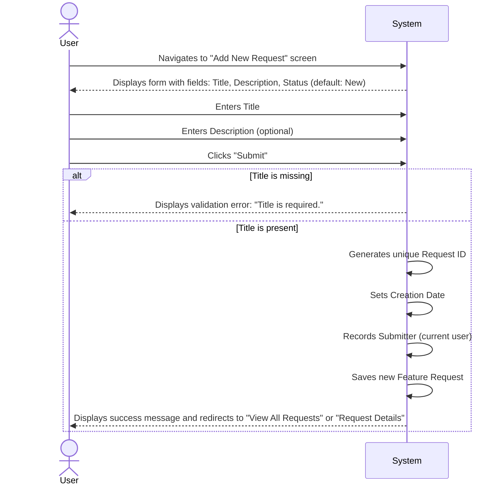

# Feature Specification: Add New Feature Request

## 1. User Flow



## 2. UI/UX Requirements

*   **Screen:** "Add New Feature Request" form.
*   **Fields:**
    *   **Title:** Text input, required, max length 255 characters.
    *   **Description:** Multiline text area, optional.
    *   **Status:** Read-only dropdown defaulting to "New". (Future: allow initial status selection based on permissions).
*   **Buttons:**
    *   "Submit": Creates the request.
    *   "Cancel": Discards changes and returns to the previous screen.
*   **Validation:** Client-side validation for required fields.
*   **Feedback:** Success message upon successful submission, error messages for validation failures.

## 3. Technical Considerations

*   **API Endpoint:** `POST /api/feature-requests`
*   **Request Body:**
    ```json
    {
        "title": "string",
        "description": "string (optional)",
        "status": "string" // Default to "New" on backend if not provided
    }
    ```
*   **Response:**
    *   `201 Created` with the newly created feature request object.
    *   `400 Bad Request` for validation errors.
*   **Database Schema (Proposed):**
    *   `id`: UUID (Primary Key)
    *   `title`: VARCHAR(255)
    *   `description`: TEXT (nullable)
    *   `status`: VARCHAR(50) (e.g., "New", "In Progress", "Completed", "Rejected")
    *   `created_at`: TIMESTAMP
    *   `created_by`: UUID (User ID)

## 4. Acceptance Criteria

*   A user can successfully submit a new feature request with a title and optional description.
*   Upon submission, a unique ID is generated, and the request is saved with a "New" status.
*   The creation date and submitting user are automatically recorded.
*   Attempting to submit a request without a title results in a clear error message.
*   After successful submission, the user is redirected to a relevant view (e.g., the list of all requests or the details of the newly created request).