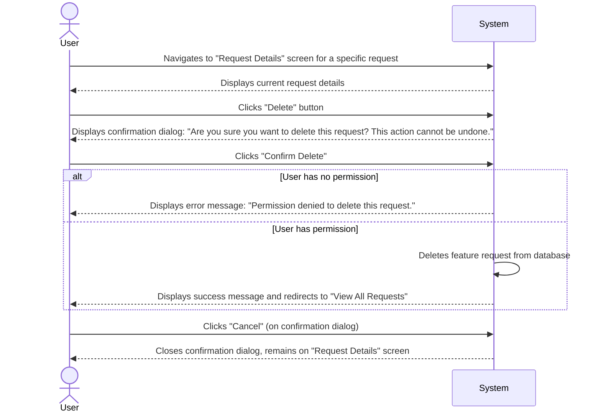

# Feature Specification: Delete Request

## 1. User Flow

## 2. UI/UX Requirements

*   **Screen:** "Request Details" page.
*   **Delete Button:** A clearly labeled "Delete" button, potentially styled to indicate a destructive action (e.g., red color).
*   **Confirmation Dialog:**
    *   A modal or pop-up dialog asking for confirmation.
    *   Message: "Are you sure you want to delete this request? This action cannot be undone."
    *   Buttons: "Confirm Delete" (primary, destructive) and "Cancel" (secondary).
*   **Feedback:** Success message upon successful deletion, error messages for permission issues.
*   **Redirection:** After successful deletion, the user should be redirected to the "View All Requests" screen.

## 3. Technical Considerations

*   **API Endpoint:** `DELETE /api/feature-requests/{id}`
*   **Request Body:** None.
*   **Response:**
    *   `204 No Content` upon successful deletion.
    *   `403 Forbidden` for permission denied.
    *   `404 Not Found` if the request ID does not exist.
*   **Database Operation:** Hard delete of the feature request record. (Future: soft delete for audit trails).
*   **Permissions:** Backend should enforce that only users with "Product Manager" role (or similar administrative role) can delete requests.

## 4. Acceptance Criteria

*   A Product Manager can initiate the deletion of a feature request from its details page.
*   A confirmation dialog is displayed, requiring explicit confirmation before deletion.
*   Upon confirmation, the feature request is permanently removed from the system.
*   After successful deletion, the user is redirected to the "View All Requests" page.
*   Users without the necessary permissions are prevented from deleting requests and receive an appropriate error message.
*   Canceling the deletion process returns the user to the request details page without any changes.