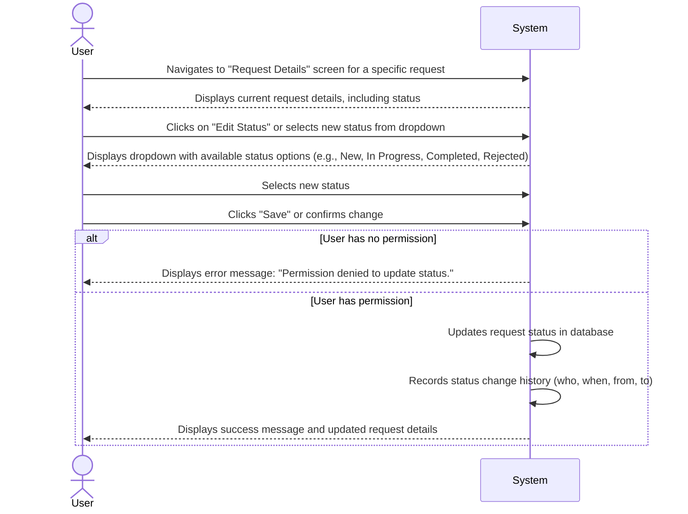

# Feature Specification: Update Request Status

## 1. User Flow



## 2. UI/UX Requirements

*   **Screen:** "Request Details" page.
*   **Status Display:** The current status should be prominently displayed.
*   **Status Update Mechanism:**
    *   A dropdown or clickable element to change the status.
    *   Available statuses: "New", "In Progress", "Completed", "Rejected". (Future: configurable statuses).
*   **Feedback:** Success message upon successful update, error messages for permission issues or invalid status transitions.
*   **History:** A section on the "Request Details" page to show the history of status changes (e.g., "Status changed from 'New' to 'In Progress' by John Doe on YYYY-MM-DD HH:MM").

## 3. Technical Considerations

*   **API Endpoint:** `PUT /api/feature-requests/{id}/status`
*   **Request Body:**
    ```json
    {
        "status": "string" // e.g., "In Progress"
    }
    ```
*   **Response:**
    *   `200 OK` with the updated feature request object.
    *   `400 Bad Request` for invalid status transitions.
    *   `403 Forbidden` for permission denied.
    *   `404 Not Found` if the request ID does not exist.
*   **Database Schema (Proposed additions):**
    *   `feature_requests` table:
        *   `status`: VARCHAR(50)
    *   `status_history` table:
        *   `id`: UUID (Primary Key)
        *   `request_id`: UUID (Foreign Key to `feature_requests.id`)
        *   `old_status`: VARCHAR(50)
        *   `new_status`: VARCHAR(50)
        *   `changed_at`: TIMESTAMP
        *   `changed_by`: UUID (User ID)

## 4. Acceptance Criteria

*   A user can change the status of an existing feature request to any valid status.
*   The system successfully updates the status in the database.
*   The system records the history of status changes, including the old status, new status, timestamp, and the user who made the change.
*   The updated status is immediately reflected on the "Request Details" page and the "View All Requests" list.
*   Users without appropriate permissions are prevented from updating the status and receive an error message.