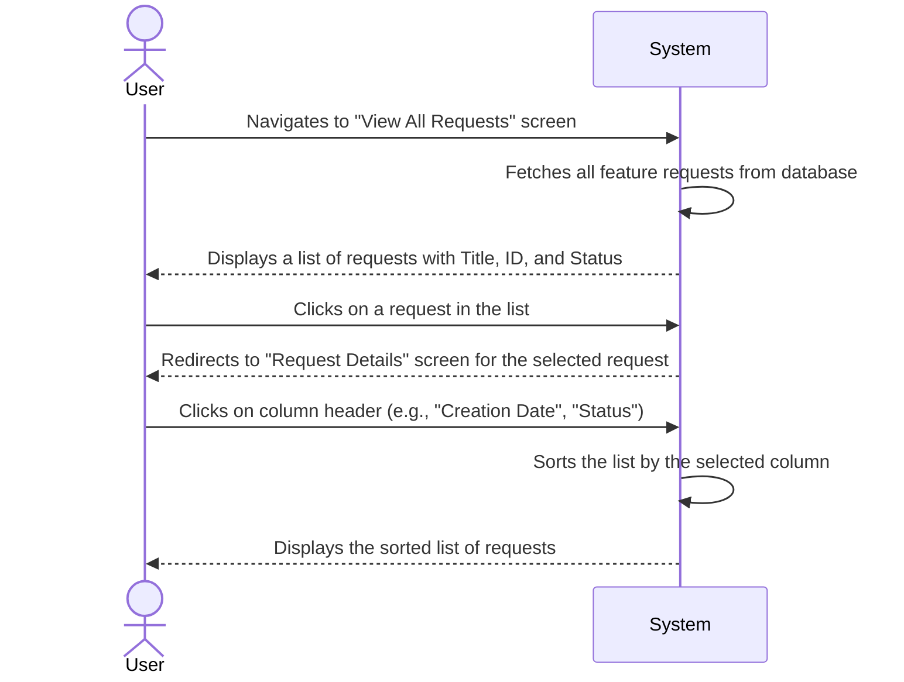

# Feature Specification: View All Requests

## 1. User Flow

## 2. UI/UX Requirements

*   **Screen:** "All Feature Requests" list view.
*   **Display Columns:**
    *   Request ID (unique identifier)
    *   Title
    *   Status
    *   Creation Date (Future: Submitter, Last Updated)
*   **Sorting:**
    *   Clickable column headers for "Creation Date" and "Status" to sort in ascending/descending order.
*   **Interaction:**
    *   Each row in the list should be clickable, leading to the "Request Details" page for that specific request.
*   **Empty State:** A clear message should be displayed if no feature requests exist.

## 3. Technical Considerations

*   **API Endpoint:** `GET /api/feature-requests`
*   **Query Parameters (Optional):**
    *   `sort_by`: `created_at`, `status`, `title` (default: `created_at`)
    *   `sort_order`: `asc`, `desc` (default: `desc`)
    *   `page`: `number` (for pagination, future enhancement)
    *   `limit`: `number` (for pagination, future enhancement)
*   **Response:**
    *   `200 OK` with an array of feature request objects.
    *   Each object should contain: `id`, `title`, `status`, `created_at`.
*   **Database Query:** Efficient retrieval of all requests, with options for sorting.

## 4. Acceptance Criteria

*   A user can view a paginated list of all feature requests.
*   Each item in the list displays the request's unique ID, title, and current status.
*   The list is sortable by "Creation Date" and "Status" in both ascending and descending order.
*   Clicking on a request in the list navigates the user to the detailed view of that request.
*   If no requests exist, a message indicating an empty list is displayed.