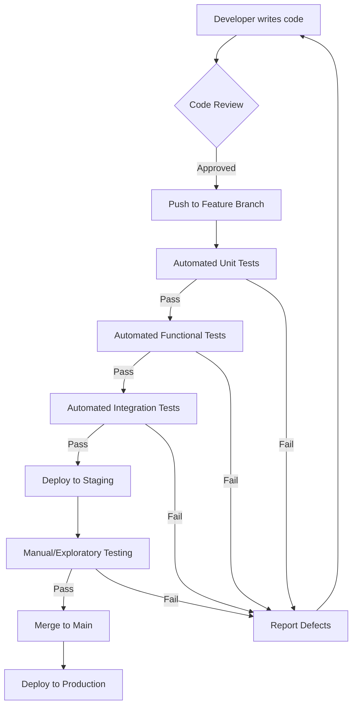

# Test Strategy Document: Feature Request Tracker Backend

## 1. Introduction & Objectives

This Test Strategy Document (TSD) outlines the comprehensive approach to testing the Feature Request Tracker Backend. The primary objective is to ensure the quality, reliability, and performance of the backend services, including the database schema and Prisma ORM implementation, as defined in the Product Requirements Document (PRD) and Technical Requirements Document (TRD).

**Key Objectives:**
*   Verify that all API endpoints function correctly according to specifications.
*   Ensure data integrity and consistency through the Prisma ORM and database schema.
*   Validate middleware functionality (validation, error handling, logging).
*   Confirm adherence to security and performance considerations.
*   Provide a structured framework for all testing activities.

## 2. Scope

The scope of this test strategy covers the entire Feature Request Tracker Backend, including:
*   **API Endpoints:** CRUD operations for feature requests (`/api/feature-requests`).
*   **Database Schema:** `FeatureRequest` and `StatusChange` models, including relationships and data types.
*   **Prisma ORM Implementation:** Verification of database interactions (create, read, update, delete).
*   **Middleware:** Validation, error handling, and logging.
*   **Business Logic:** Status change tracking and associated rules.

**In-Scope:**
*   Unit Testing of individual functions and modules.
*   Functional Testing of API endpoints.
*   Integration Testing of component interactions (API with database, middleware integration).
*   Performance Testing (basic load and response time checks).
*   Security Testing (basic vulnerability scanning and authentication checks).

**Out-of-Scope (for this document):**
*   Frontend application testing.
*   User Acceptance Testing (UAT) with end-users.
*   Detailed security penetration testing.
*   Extensive performance stress testing.

## 3. Testing Types & Levels

This strategy will employ a multi-level testing approach:

### 3.1. Unit Testing
*   **Focus:** Individual functions, methods, and classes in isolation.
*   **Objective:** Verify the correctness of the smallest testable parts of the application.
*   **Tools:** Jest (as indicated by `tests/README.md` examples).
*   **Coverage:** Core business logic, utility functions, data transformations.

### 3.2. Functional Testing
*   **Focus:** API endpoints and their adherence to functional requirements.
*   **Objective:** Validate the complete request-response cycle for each API, including middleware, business logic, and database interactions.
*   **Tools:** Jest, Supertest (as indicated by `tests/README.md` examples).
*   **Coverage:** All defined API endpoints (`POST /api/feature-requests`, `GET /api/feature-requests`, `GET /api/feature-requests/:id`, `PUT /api/feature-requests/:id/status`, `DELETE /api/feature-requests/:id`).

### 3.3. Integration Testing
*   **Focus:** Interactions between different modules, services, and the database.
*   **Objective:** Ensure that integrated components work together seamlessly.
*   **Tools:** Jest, Supertest, Prisma Client.
*   **Coverage:** API-to-database interactions, middleware chains, end-to-end user flows involving multiple API calls.

### 3.4. Performance Testing
*   **Focus:** API response times and system scalability under load.
*   **Objective:** Identify performance bottlenecks and ensure the system meets response time requirements.
*   **Tools:** (To be determined, e.g., k6, JMeter)
*   **Coverage:** Key API endpoints, especially those with high expected traffic.

### 3.5. Security Testing
*   **Focus:** Vulnerabilities, authentication, authorization, and data protection.
*   **Objective:** Identify security flaws and ensure compliance with security best practices.
*   **Tools:** (To be determined, e.g., OWASP ZAP, Postman for manual checks)
*   **Coverage:** Authentication flows, input sanitization, access control for sensitive operations.

## 4. Test Approach

The testing approach will be iterative and integrated into the development lifecycle.

### 4.1. Test Design
*   Test cases will be derived from the PRD, TRD, and existing `tests/README.md`.
*   Emphasis on clear, concise, and maintainable test cases.
*   Prioritization of test cases based on risk and business criticality.

### 4.2. Test Execution
*   Automated tests will be executed as part of the CI/CD pipeline.
*   Manual testing will be performed for exploratory testing and complex scenarios not easily automated.
*   Regression testing will be conducted after each significant code change or release.

### 4.3. Data Management
*   A dedicated test database will be used, separate from development and production environments.
*   Test data will be generated or seeded to cover various scenarios (happy path, edge cases, error conditions).
*   Database cleanup will be performed before and after each test run to ensure test isolation and a clean state, as outlined in `tests/README.md`.

### 4.4. Defect Management
*   Defects will be logged, tracked, and prioritized using a suitable issue tracking system.
*   Clear defect descriptions, steps to reproduce, and expected/actual results will be provided.
*   Defects will be retested upon resolution to confirm fixes.

## 5. Environments & Tools

### 5.1. Development Environment
*   **Purpose:** Local development and initial unit/functional testing.
*   **Tools:** Node.js, npm, VS Code, Prisma CLI, Git.

### 5.2. Test Environment
*   **Purpose:** Automated functional, integration, performance, and security testing.
*   **Configuration:** Mimics production environment as closely as possible.
*   **Database:** PostgreSQL (or similar, as configured in `prisma/schema.prisma`) with a dedicated test database instance.
*   **Tools:**
    *   **Testing Framework:** Jest
    *   **HTTP Client for API Testing:** Supertest
    *   **ORM:** Prisma Client
    *   **CI/CD:** GitHub Actions (or similar)

### 5.3. Tools Overview
*   **Version Control:** Git / GitHub
*   **Documentation:** Markdown (`docs/prd.md`, `docs/trd-backend.md`, `tests/README.md`)
*   **Testing Frameworks:** Jest, Supertest
*   **Database:** PostgreSQL (or SQLite for local development/testing)
*   **API Documentation:** Swagger/OpenAPI (as per TRD)

## 6. Roles & Responsibilities

*   **QA Lead Engineer:** Defines test strategy, oversees test planning, reviews test cases, manages test execution, reports on quality metrics.
*   **QA Document Writer:** Creates and maintains test strategy documents, test plans, and test cases.
*   **QA Coder:** Implements automated test cases (unit, functional, integration), performs manual testing, reports defects.
*   **Developers:** Write unit tests for their code, fix defects, support QA in understanding features.
*   **Product Manager:** Provides requirements, clarifies ambiguities, participates in UAT.

## 7. Entry/Exit Criteria

### 7.1. Test Entry Criteria
*   PRD and TRD are approved and baselined.
*   Test Strategy Document is approved.
*   Test environment is set up and stable.
*   Required test data is available.
*   All critical dependencies are resolved.
*   Code is feature-complete for the current iteration and deployed to the test environment.

### 7.2. Test Exit Criteria
*   All critical and high-priority test cases passed.
*   Achieved target test coverage (e.g., 80% code coverage for unit tests).
*   All critical and high-priority defects are resolved and retested.
*   No open blockers or major issues.
*   Performance and security benchmarks are met.
*   Test summary report is generated and approved.

## 8. Risks & Mitigation

| Risk | Mitigation Strategy |
|---|---|
| **Incomplete Requirements** | Regular communication with PM, review PRD/TRD, create TODOs for ambiguities. |
| **Insufficient Test Data** | Develop robust test data generation scripts, utilize database seeding. |
| **Environment Instability** | Dedicated test environment, automated environment setup/teardown, monitoring. |
| **Scope Creep** | Strict adherence to PRD/TRD, clear definition of in-scope/out-of-scope. |
| **Lack of Automation** | Prioritize automation for repetitive tasks, integrate tests into CI/CD. |
| **Performance Bottlenecks** | Early performance testing, profiling, and optimization. |
| **Security Vulnerabilities** | Implement security best practices, conduct regular security scans. |

## 9. Reporting & Metrics

Test results will be regularly reported to stakeholders.

### 9.1. Key Metrics
*   **Test Case Pass/Fail Rate:** Percentage of passed, failed, and skipped test cases.
*   **Test Coverage:** Code coverage for unit and integration tests.
*   **Defect Density:** Number of defects per unit of code.
*   **Defect Trend:** Tracking defect discovery and resolution rates over time.
*   **Test Execution Time:** Time taken to run automated test suites.

### 9.2. Reporting Frequency
*   Daily reports during active testing phases.
*   Weekly summary reports for stakeholders.
*   Comprehensive final test report at the end of each major release cycle.

## 10. Workflow and CI/CD Test Integration

### 10.1. Development Workflow


### 10.2. CI/CD Test Integration
```mermaid
graph TD
    A[Code Commit] --> B(GitHub Actions Trigger);
    B --> C{Build Application};
    C -- Success --> D[Run Unit Tests];
    D -- Success --> E[Run Functional Tests];
    E -- Success --> F[Run Integration Tests];
    F -- Success --> G[Generate Test Reports];
    G --> H[Deploy to Staging Environment];
    H --> I[Notify Stakeholders];
    C -- Failure --> J[Notify Developer];
    D -- Failure --> J;
    E -- Failure --> J;
    F -- Failure --> J;