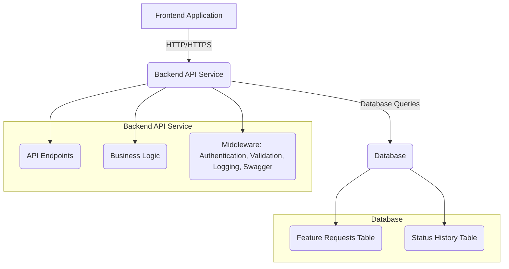

# Technical Requirements Document: Feature Request Tracker Backend

## 1. Introduction

This document outlines the high-level technical requirements for the backend of the Feature Request Tracker. It serves as a guide for the development team, detailing the system architecture, API specifications, data model, and key technical considerations to support the MVP features defined in the Product Requirements Document (PRD).

## 2. System Design

The backend will follow a typical N-tier architecture, separating concerns into presentation (handled by frontend), application logic (API), and data storage (Database).

### 2.1. Architecture Diagram


*   **Link to PRD:** This section directly supports the "Problem Statement" and "MVP Features" outlined in the [PRD#2. Problem Statement](docs/prd.md#2-problem-statement) and [PRD#5. Minimum Viable Product (MVP) Features](docs/prd.md#5-minimum-viable-product-mvp-features).

## 3. API Endpoints

The backend will expose RESTful API endpoints to manage feature requests.

### 3.1. Feature Request Endpoints (`/api/feature-requests`)

*   **`POST /api/feature-requests`**
    *   **Description:** Creates a new feature request.
    *   **Request Body:**
        ```json
        {
            "title": "string",
            "description": "string (optional)"
        }
        ```
    *   **Response:** `201 Created` with the new feature request object.
    *   **Related PRD Feature:** [PRD#5.1. Add New Feature Request](docs/prd.md#51-add-new-feature-request)

*   **`GET /api/feature-requests`**
    *   **Description:** Retrieves a list of all feature requests. Supports sorting.
    *   **Query Parameters:** `sort_by` (e.g., `created_at`, `status`), `sort_order` (e.g., `asc`, `desc`).
    *   **Response:** `200 OK` with an array of feature request objects.
    *   **Related PRD Feature:** [PRD#5.3. View All Requests](docs/prd.md#53-view-all-requests)

*   **`GET /api/feature-requests/:id`**
    *   **Description:** Retrieves details of a specific feature request by ID.
    *   **Response:** `200 OK` with the feature request object. `404 Not Found` if ID does not exist.
    *   **Related PRD Feature:** Implied by [PRD#5.3. View All Requests](docs/prd.md#53-view-all-requests) (clicking on a request to view details).

*   **`PUT /api/feature-requests/:id/status`**
    *   **Description:** Updates the status of a specific feature request.
    *   **Request Body:**
        ```json
        {
            "status": "string" // e.g., "In Progress"
        }
        ```
    *   **Response:** `200 OK` with the updated feature request object. `400 Bad Request` for invalid status, `403 Forbidden` for permissions, `404 Not Found`.
    *   **Related PRD Feature:** [PRD#5.2. Update Request Status](docs/prd.md#52-update-request-status)

*   **`DELETE /api/feature-requests/:id`**
    *   **Description:** Deletes a specific feature request by ID.
    *   **Response:** `204 No Content` on success. `403 Forbidden` for permissions, `404 Not Found`.
    *   **Related PRD Feature:** [PRD#5.4. Delete Request](docs/prd.md#54-delete-request)

## 4. Data Model (Prisma Schema)

The data model will be managed using Prisma ORM, providing a type-safe and efficient way to interact with the database.

```prisma
// schema.prisma

generator client {
  provider = "prisma-client-js"
}

datasource db {
  provider = "postgresql" // Example: PostgreSQL
  url      = env("DATABASE_URL")
}

enum RequestStatus {
  NEW
  IN_PROGRESS
  COMPLETED
  REJECTED
}

model FeatureRequest {
  id          String        @id @default(uuid())
  title       String        @db.VarChar(255)
  description String?       @db.Text
  status      RequestStatus @default(NEW)
  createdAt   DateTime      @default(now())
  updatedAt   DateTime      @updatedAt
  createdBy   String        // User ID of the creator (future: link to User model)
  statusHistory StatusChange[]
}

model StatusChange {
  id           String        @id @default(uuid())
  featureRequestId String
  featureRequest FeatureRequest @relation(fields: [featureRequestId], references: [id])
  oldStatus    RequestStatus
  newStatus    RequestStatus
  changedAt    DateTime      @default(now())
  changedBy    String        // User ID of the changer (future: link to User model)
}
```
*   **Link to PRD:** This data model supports all MVP features, particularly [PRD#5.1. Add New Feature Request](docs/prd.md#51-add-new-feature-request) and [PRD#5.2. Update Request Status](docs/prd.md#52-update-request-status).

## 5. Middleware

### 5.1. API Documentation (Swagger/OpenAPI)

*   **Description:** Implement Swagger/OpenAPI for automatic API documentation generation. This will provide an interactive interface for developers to understand and test API endpoints.
*   **Benefit:** Improves developer experience, facilitates frontend-backend integration, and serves as a living documentation.

### 5.2. Validation

*   **Description:** Implement request payload validation (e.g., using Joi or Zod) to ensure data integrity and prevent malformed requests.
*   **Benefit:** Enhances API robustness and security.

### 5.3. Error Handling

*   **Description:** Implement a centralized error handling mechanism to provide consistent and informative error responses (e.g., 400 Bad Request, 401 Unauthorized, 403 Forbidden, 404 Not Found, 500 Internal Server Error).
*   **Benefit:** Improves API usability and debugging.

### 5.4. Logging

*   **Description:** Implement structured logging for API requests, responses, and errors to aid in monitoring, debugging, and auditing.
*   **Benefit:** Provides visibility into system behavior and performance.

## 6. Security Notes

*   **Authentication & Authorization:** For MVP, assume basic API key or token-based authentication. Future phases will integrate robust user authentication (e.g., OAuth2, JWT) and role-based access control (RBAC) to enforce permissions (e.g., only Product Managers can delete requests).
*   **Input Sanitization:** All user inputs must be sanitized to prevent common vulnerabilities like SQL injection and XSS.
*   **HTTPS:** All API communication must occur over HTTPS to ensure data encryption in transit.
*   **Environment Variables:** Sensitive information (database credentials, API keys) must be stored as environment variables, not hardcoded.

## 7. Scalability Notes

*   **Stateless API:** The API should be designed to be stateless to allow for easy horizontal scaling of backend instances.
*   **Database Indexing:** Implement appropriate database indexing on frequently queried columns (e.g., `id`, `status`, `createdAt`) to optimize read performance.
*   **Connection Pooling:** Utilize database connection pooling to efficiently manage database connections.
*   **Caching (Future):** Consider implementing caching mechanisms (e.g., Redis) for frequently accessed data in future phases to reduce database load.